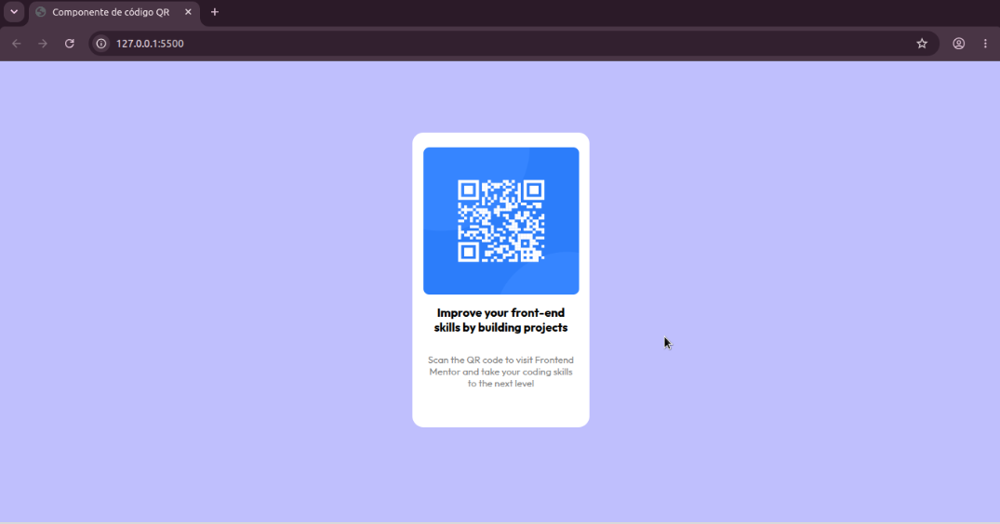

# Componente de Card com Código QR 📱

Esta é uma solução para o desafio do componente de código QR do [Frontend Mentor](https://www.frontendmentor.io/). 
O objetivo foi construir um componente de card responsivo e centralizado utilizando boas práticas de HTML5 e CSS3.

## 🚀 Demonstração

- **Resultado final:**

 

---

## 🛠️ Tecnologias Utilizadas

- **HTML5:** Estruturação semântica
- **CSS3:** Estilização, Flexbox para alinhamento e layout responsivo
- **Mobile-first workflow:** Construído pensando no design responsivo

---

## 💡 O que eu aprendi

Neste projeto, pratiquei conceitos fundamentais de CSS, tais como:

- Centralização absoluta de elementos na tela usando **Flexbox**.
- Controle de largura de caixas e contêineres (`width`, `max-width` e `box-sizing: border-box`).
- Ajuste e distribuição de textos longos para evitar quebras inadequadas de palavras (`white-space`, `text-align`).
- Gerenciamento de espaçamentos internos e externos (`padding` e `margin`) para um layout limpo.

---

## 📂 Como executar o projeto

1. Clone este repositório:
   ```bash
   git clone [https://github.com/seu-usuario/nome-do-repositorio.git](https://github.com/seu-usuario/nome-do-repositorio.git)

   
👤 Autor

GitHub - @MileneGeraldo98

Frontend Mentor - @MileneGeraldo98
